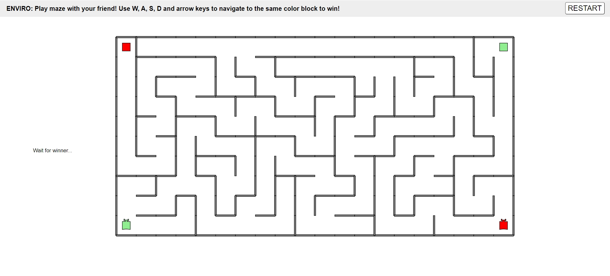

# Maze Game
Welcome to the Maze Game project! This project allows you to play a maze game with your friend.

## Overview
The goal of this project is to provide an interactive maze game where players can navigate through a maze with their friend. The maze is randomly generated using depth-first search algorithm.

## Installation and Running
To install and run the code, follow these steps:  
1. Install [enviro v1.61](https://github.com/klavinslab/enviro).
2. Clone the repository to your local machine.
3. Navigate to the project directory and run `make`.
4. run `esm start`  
5. run `enviro`
6. Navigate to `http://localhost`
## How to Play
Once the game is running, follow these instructions to play:
* Click `RESTART` button to regenerate the maze and reset the robot.
* For player 1 (green robot), use the W, A, S, D keys to move.
* For player 2 (red robot), use arrow keys to move.
* Navigate through the maze to reach the block with the same color of your robot to win.

## Key Challenges and Solutions
1. Maze Generation: Generating a maze with proper connectivity and obstacles posed a challenge. This was addressed by implementing a depth-first search algorithm in the MazeGenerator class.
2. Agent Coordination: Coordinating the add and remove of agents and ensuring they interact properly within the maze required careful handling. This was resolved by implementing the CoordinatorController class to manage agent initialization and clear.
3. User Interface: Providing clear instructions and visual feedback for players was important. This was tackled by designing a simple interface and updating it dynamically based on game events.

## Sources
This project get inspiration and utilizes code from enviro [examples](https://github.com/klavinslab/enviro/tree/master/examples).

Enjoy playing the Maze Game! 🎮🌟
